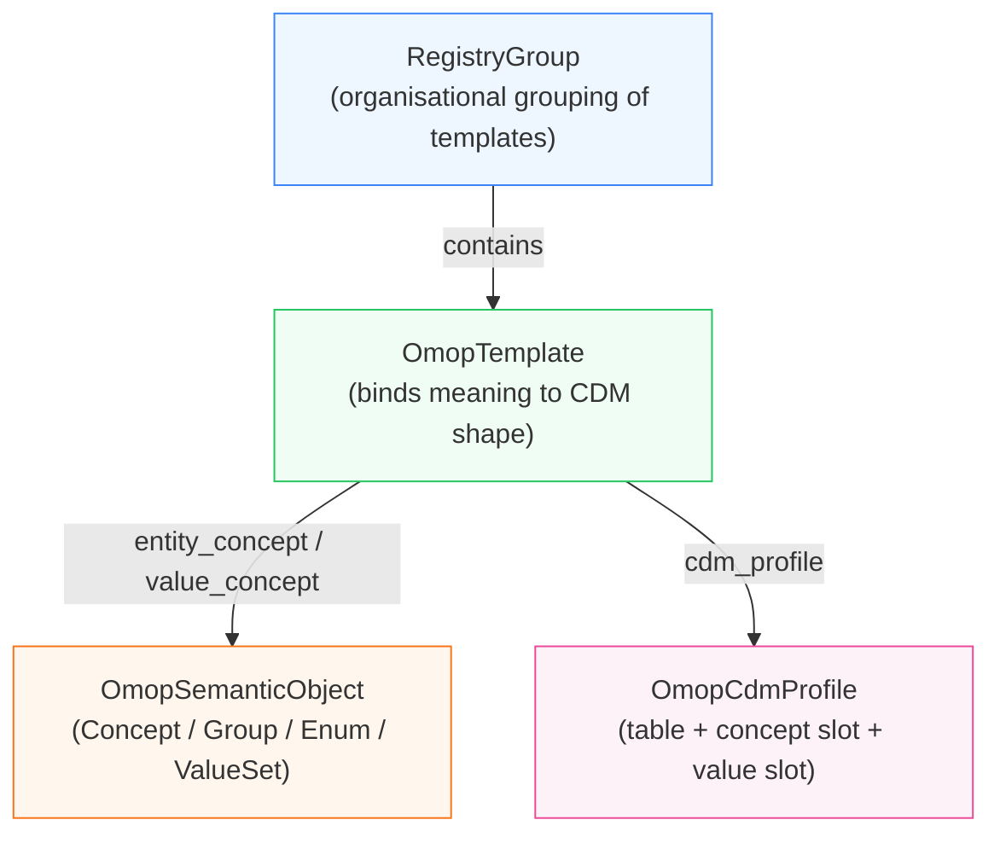

# OMOP Semantics

**omop-semantics** is a schema-backed registry for defining and managing semantic conventions on top of the OMOP CDM.

It gives you a structured, versioned, portable way to describe which OMOP concepts are valid in a given context, how they map to CDM table shapes, and what fallback concepts to use when a mapping cannot be completed. The definitions live in YAML and Python, not in SQL or comments.

## What problem this solves

OMOP CDM tables are permissive by design. In practice, most projects apply additional conventions: which condition concepts are valid for tumour phenotyping, how staging modifier concepts should be linked to episodes, what value slot a language-spoken observation should use. These conventions are usually scattered across ETL code, SQL, and documentation.

omop-semantics provides a structured layer for encoding those conventions explicitly — as versioned, testable, inspectable definitions — and for consuming them consistently across ETL, analytics, and documentation.

## Core design

The library works at four layers:

| Layer | What it is | Examples |
|---|---|---|
| **Semantic primitives** | What kind of OMOP thing is this? | `OmopConcept`, `OmopGroup`, `OmopEnum`, `OmopValueSet` |
| **Structural templates** | How does this get written into a CDM row? | `OmopTemplate` |
| **Registry organisation** | How are definitions grouped and published? | `RegistryFragment`, `RegistryGroup` |
| **CDM profiles** | What shape of CDM row is being written? | `observation_coded`, `measurement_numeric` |



### Semantic primitives

- **`OmopConcept`** — a single OMOP concept_id with an optional label
- **`OmopGroup`** — a set of anchor concepts whose OMOP descendants form the intended membership; resolves to anchor `parent_concepts` at runtime
- **`OmopEnum`** — a fixed, explicitly listed set of concepts that does not change with vocabulary updates
- **`OmopValueSet`** — a composite of the above, used when a template slot accepts concepts from multiple groups or enums

## Three runtime surfaces

At runtime, the library exposes three independent surfaces:

**Value-set runtime** — stable named concept ids for use in application code:
```python
from omop_semantics.runtime.default_valuesets import runtime
runtime.types.disease_episode_types.episode_of_care  # → 32533
```

**Template/profile runtime** — compiled templates, CDM profiles, and profile groups:
```python
from omop_semantics.runtime import OmopSemanticEngine
engine = OmopSemanticEngine.from_yaml_paths(registry_paths=[...])
tpl = engine.registry_runtime.get_runtime("Country of birth")
```

**Fallback concepts** — canonical unknown/default concepts with reason codes:
```python
from omop_semantics.unknowns import UNKNOWN
UNKNOWN["condition"].concept_id   # → 44790729
UNKNOWN["condition"].reason       # → "mapping_failed"
```

## Portability

omop-semantics requires no live vocabulary database and performs no descendant expansion at load time. Runtime artefacts are anchor-based and structural. Descendant expansion belongs in a downstream database-aware layer.

## Start here

- [Usage](usage.md) — loading paths and code patterns
- [Data Model](data-model.md) — profiles, templates, and semantic objects
- [Schema & Instances](schema-and-instances.md) — authoring assets and file organisation
- [Fallback Concepts](unknowns.md) — the shipped unknown and default concepts
- [Internals](internals.md) — package structure and what happens at load time
